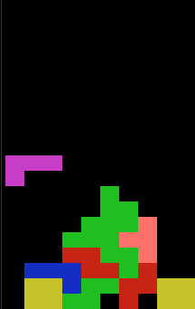

# TetrisGo
A go implementation of the classic tetris game


## Install
```bash
go get github.com/jaymoneyjay/TetrisGo
```

## Instructions
```bash
q: 			quit
right: 	move right
left:		move left
down:		move down
up:			rotate
```